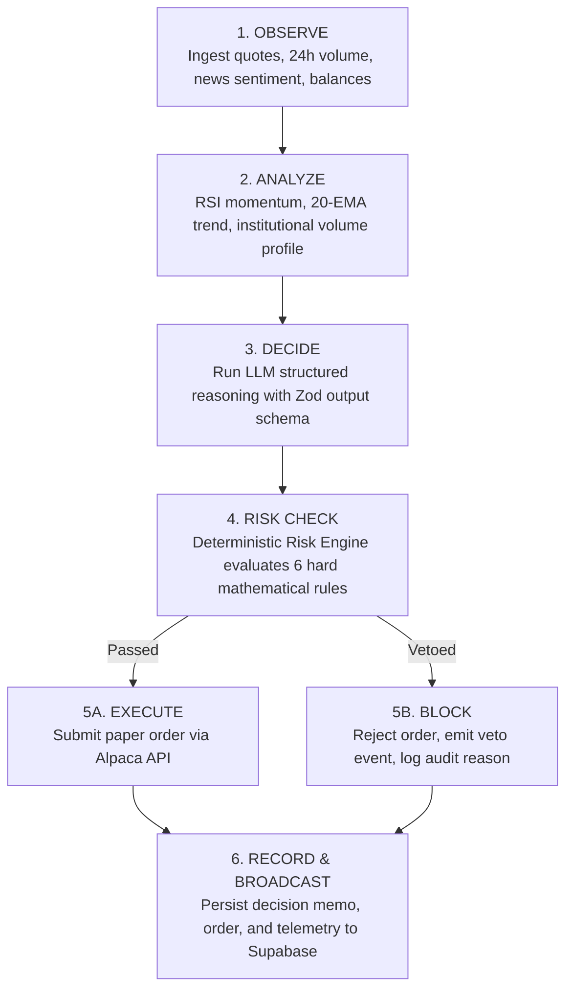

# SENTINEL — AI Trading Agent & Multi-Stage Pipeline Specification (Phase 6)

---

## 1. Agent Design Philosophy

The SENTINEL Agent functions like an institutional quantitative analyst preparing an auditable investment memo for a risk committee:
1. **Explainability First:** The agent must articulate the "why" behind every proposal using plain financial reasoning.
2. **Calibrated Confidence:** Algorithmic conviction (0 to 100) must reflect telemetry quality and penalize conflicting indicators or high volatility.
3. **Structured Outputs:** All responses are strictly enforced via Zod schemas, eliminating markdown hallucinations or malformed JSON.
4. **Decoupled Execution:** The LLM only proposes trade hypotheses; the independent mathematical Risk Engine holds absolute veto authority.

---

## 2. The 6-Stage Autonomous Pipeline

Located in [`backend/src/services/agentService.ts`](file:///c:/Users/BusinessComputers.in/Pictures/New%20folder%20(2)/backend/src/services/agentService.ts):



### Stage Details:
1. **`OBSERVE`**: Fetches real-time stock quote, day high/low, volume, news headline & sentiment score, and current portfolio equity & cash balances.
2. **`ANALYZE`**: Estimates technical momentum (RSI, 20-day EMA moving average cross) and evaluates institutional accumulation vs. sector headwinds.
3. **`DECIDE`**: Calls `llmService.analyzeAsset(...)` generating trade recommendation (`action`, `confidence`, `reasoning`, `suggestedShares`, `suggestedAllocationPct`, `keyLevels`).
4. **`RISK_CHECK`**: Passes proposal to deterministic risk engine (`riskService.evaluateProposal(...)`). Evaluates all 6 safety rules:
   * Max Position Exposure ($\le 10\%$)
   * Max Single Trade Size ($\le 5\%$)
   * Daily Loss Circuit Breaker ($\le 2\%$)
   * Minimum AI Confidence ($\ge 70\%$)
   * Max Daily Executions ($\le 10$)
   * Max Sector Exposure ($\le 40\%$)
5. **`EXECUTE OR BLOCK`**:
   * **If Approved:** Submits paper order via `alpacaService.submitPaperOrder(...)`, receives Alpaca order ID, updates portfolio positions and cash.
   * **If Blocked:** Rejects execution, logs violated risk rules, creates blocked trade record, and logs compliance audit event.
6. **`RECORD`**: Saves decision memo to `decisionRepository`, orders to `orderRepository`, and stage trace events to `activityRepository`.

---

## 3. Transparency Feed & Real-Time Event Stream

Each stage emits structured telemetry events containing:
* `stage`: `"OBSERVE" | "ANALYZE" | "DECIDE" | "RISK_CHECK" | "EXECUTION" | "COMPLETE" | "BLOCKED"`
* `title`: Concise human-readable milestone (e.g. *"Alpaca Paper Order Filled: BUY 15 NVDA"*)
* `message`: Detailed explanation with exact prices, shares, and risk rules evaluated
* `status`: `"success" | "warning" | "error" | "info"`
* `details`: JSON payload with technical indicators, checks, and fill prices

---

## 4. Automated Test Verification

Automated test suite in [`backend/src/__tests__/agent.test.ts`](file:///c:/Users/BusinessComputers.in/Pictures/New%20folder%20(2)/backend/src/__tests__/agent.test.ts) verifies:
* **Scenario A (Approved Flow - NVDA):** Full 6-stage execution, 6/6 risk rules passed, order submitted via Alpaca, status `APPROVED_EXECUTED`.
* **Scenario B (Vetoed Flow - TSLA):** Low conviction / excess allocation caught by risk engine, status `BLOCKED_BY_RISK`, zero broker orders submitted, veto logged in audit trail.
* **Transparency Stream:** Verified chronological stage progression (`OBSERVE` $\to$ `ANALYZE` $\to$ `DECIDE` $\to$ `RISK_CHECK` $\to$ `COMPLETE`).
* **Repository Persistence:** Decision memos, open orders, and activity logs accurately retrieved from repository layer.

**Test Results:**
```text
 ✓ src/__tests__/alpaca.test.ts (9 tests) 11ms
 ✓ src/__tests__/database.test.ts (9 tests) 10ms
 ✓ src/__tests__/llm.test.ts (6 tests) 14ms
 ✓ src/__tests__/agent.test.ts (5 tests) 10ms
 ✓ src/__tests__/api.test.ts (16 tests) 160ms
 Test Files  5 passed (5)
      Tests  45 passed (45)
   Duration  1.38s
```
