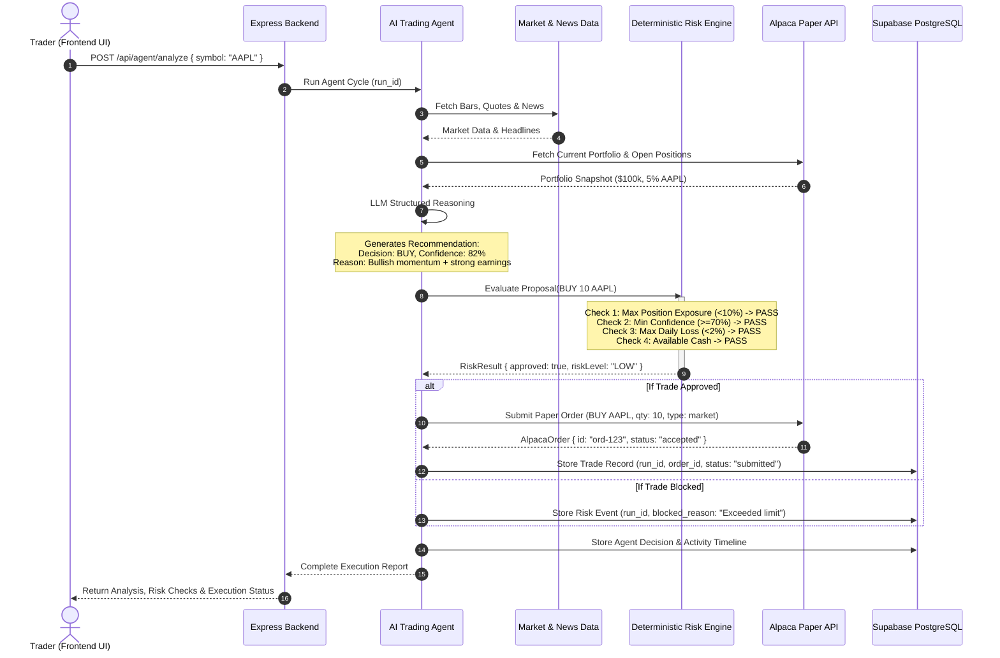

# SENTINEL — Architecture Specification

> **Tagline:** *"An explainable, risk-aware AI trading agent."*  
> **Built for:** Alpaca AI Trading Agents Hackathon

---

## 1. High-Level Architecture Overview

SENTINEL separates artificial intelligence from deterministic risk management. 

Traditional algorithmic trading bots often follow rigid rules without contextual awareness, while naive "autonomous LLM traders" can hallucinate or place erratic trades during market volatility. SENTINEL bridges this gap with a dual-layer decision pipeline:

1. **The AI Layer (Generative & Analytical):** Ingests multi-modal market indicators, news sentiment, and portfolio posture to construct hypothesis-driven trade ideas with plain-English rationales and confidence scores.
2. **The Risk Engine Layer (Deterministic & Uncompromising):** An isolated, mathematical rule engine that verifies hard financial constraints (position exposure, concentration limits, daily loss limits, minimum AI confidence). 

```
                                 +-----------------------------------------------------+
                                 |                  SENTINEL CLIENT                    |
                                 |         React + Vite + Tailwind CSS + Recharts       |
                                 |         (Web3 / Modern Fintech Dark Terminal)       |
                                 +--------------------------+--------------------------+
                                                            |
                                                            | HTTP / JSON REST API
                                                            v
                                 +-----------------------------------------------------+
                                 |                 EXPRESS BACKEND (Node.js)           |
                                 |            TypeScript + Zod Validation Layer        |
                                 +--------------------------+--------------------------+
                                                            |
                     +--------------------------------------+-------------------------------------+
                     |                                      |                                     |
                     v                                      v                                     v
         +-----------------------+              +-----------------------+             +-----------------------+
         |   AI TRADING AGENT    |              |      RISK ENGINE      |             |    ALPACA SERVICE     |
         |  (LLM + Tool Calling) |              | (Deterministic Rules) |             |  (Paper Trading Only) |
         +-----------+-----------+              +-----------+-----------+             +-----------+-----------+
                     |                                      ^                                     |
                     | 1. Generates Proposal                | 2. Validates Proposal               | 3. If Approved
                     +--------------------------------------+                                     |
                                                            |                                     v
                                                            +-------------------------> [ Submit Paper Order ]
                                                                                                  |
                                                                                                  v
                                                                                      +-----------------------+
                                                                                      |    SUPABASE / PG      |
                                                                                      |   (Audit Database)    |
                                                                                      +-----------------------+
```

---

## 2. Core Architectural Principles

1. **AI Proposes, Risk Decides, Alpaca Executes:**
   The AI agent **never** possesses the direct authority or API credentials to place an order on the exchange. It can only emit a structured trade proposal `TradeProposal`.
2. **Zero Live-Money Risk:**
   SENTINEL is strictly hardwired to the **Alpaca Paper Trading API** (`https://paper-api.alpaca.markets`). The system refuses any attempt to point to live production keys.
3. **Deterministic Superiority:**
   If the AI model is 99% confident on a BUY recommendation, but that trade exceeds the maximum position exposure limit (e.g. >10% of portfolio), the Risk Engine **blocks** the trade immediately.
4. **Full Auditability & Transparency:**
   Every AI run, input signal, intermediate reasoning step, risk check, and paper execution is assigned a unique `run_id` and logged to Supabase PostgreSQL.

---

## 3. End-to-End Data Flow Sequence



---

## 4. Subsystems Breakdown

| Subsystem | Tech Stack | Primary Responsibility |
| :--- | :--- | :--- |
| **Frontend UI** | React 19 / Vite / Tailwind CSS / Lucide / Recharts | Sleek, dark-mode terminal. Real-time portfolio monitoring, stock analysis trigger, AI explainability cards, live risk check breakdown, and transparent timeline. |
| **API Gateway** | Express.js / TypeScript / Zod | Secure REST endpoints, request payload sanitization, routing, rate-limiting, and error-handling. |
| **AI Agent** | Gemini 2.5 Flash / Tool Calling / Zod | Gathers multi-source indicators, analyzes risk-reward parameters, and formats deterministic proposals. |
| **Risk Engine** | Pure TypeScript / Functional Logic | Evaluates 6+ mathematical safety rules. Operates independently from any LLM. |
| **Alpaca Service** | `@alpacahq/alpaca-trade-api` / REST | Manages paper trading lifecycle: accounts, assets, positions, orders, and real-time market data. |
| **MCP Layer** | Model Context Protocol | Standardized tool server allowing agent discovery of Alpaca tools, portfolio queries, and market data screening. |
| **Database** | Supabase (PostgreSQL) | Immutable audit log of decisions, risk checks, executions, portfolio snapshots, and timelines. |

---

## 5. Beginner-Friendly Glossary

* **REST API:** A standardized way for programs to talk to each other over the web using simple commands like `GET` (fetch info) and `POST` (send data).
* **LLM (Large Language Model):** An AI model (like Google Gemini) that understands and generates human language and structured JSON.
* **AI Agent:** An LLM wrapped in a loop with "tools" so it can observe data, think, call functions, and summarize answers.
* **Deterministic Risk Engine:** A traditional computer program where $2 + 2$ is always $4$. It doesn't guess or hallucinate; it strictly applies mathematical thresholds.
* **Paper Trading:** Simulated trading in real market conditions with virtual money. No real money is ever placed at risk.
* **MCP (Model Context Protocol):** An open standard created to connect AI models with tools and data sources safely and uniformly.
* **Supabase / PostgreSQL:** A battle-tested relational database that stores data in structured tables with relations and strict types.
