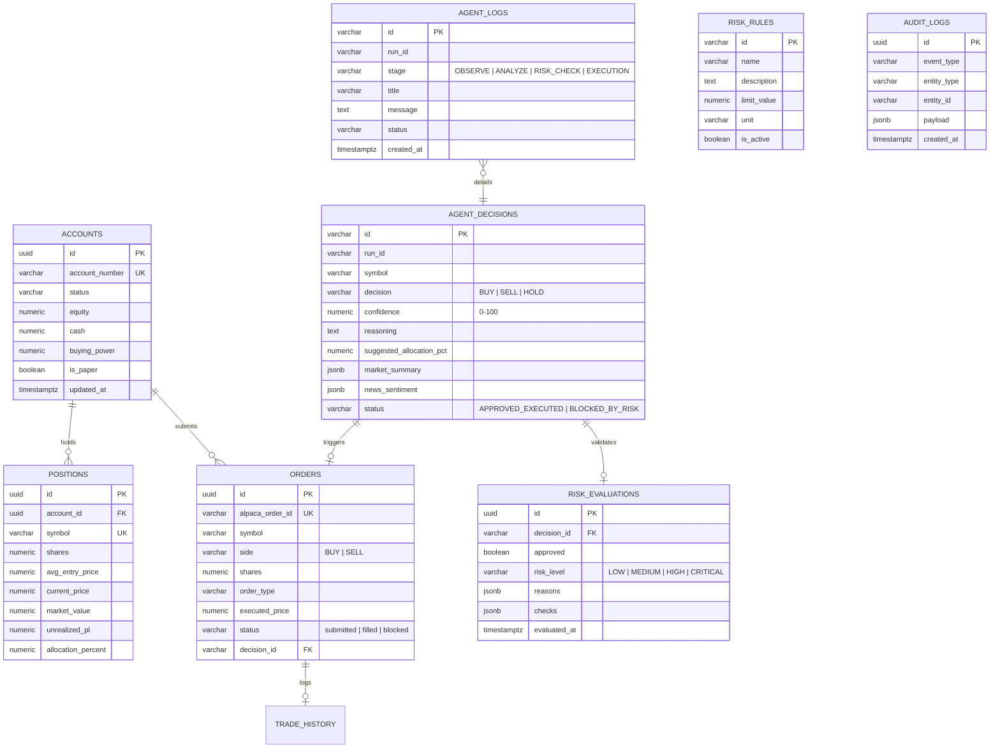

# SENTINEL — Database Architecture & Schema Specification (Phase 3)

---

## 1. Relational Entity Diagram



---

## 2. Table Specifications & Schema

All 9 tables are created via [`backend/src/db/migrations/001_initial_schema.sql`](file:///c:/Users/BusinessComputers.in/Pictures/New%20folder%20(2)/backend/src/db/migrations/001_initial_schema.sql):

1. **`accounts`**: Paper trading accounts with equity, cash, and buying power.
2. **`positions`**: Active paper holdings with cost basis, current price, and allocation weight.
3. **`orders`**: Executed and blocked order history mapped to Alpaca order IDs.
4. **`trade_history`**: Trade execution audit records.
5. **`agent_decisions`**: AI Agent reasoning memos, conviction scores, and trade proposals.
6. **`risk_evaluations`**: Deterministic mathematical risk verdicts with individual check results.
7. **`agent_logs`**: Chronological multi-stage pipeline event log (`OBSERVE` $\to$ `ANALYZE` $\to$ `DECIDE` $\to$ `RISK_CHECK` $\to$ `EXECUTION` $\to$ `RESULT`).
8. **`risk_rules`**: Configurable deterministic risk parameters.
9. **`audit_logs`**: Immutable security audit trail.

---

## 3. Seed Data Script

Initial sample data is provided in [`backend/src/db/seed.sql`](file:///c:/Users/BusinessComputers.in/Pictures/New%20folder%20(2)/backend/src/db/seed.sql):
* 1 Paper Account (`alpaca-paper-acc-sentinel-01`, \$104,850.25 equity, \$42,120.80 cash).
* 6 Standard Risk Rules (10% position limit, 5% trade limit, 2% drawdown circuit breaker, 70% min AI conviction, 10 daily trades, 40% sector cap).
* 5 Active Holdings (`AAPL`, `NVDA`, `MSFT`, `AMZN`, `SPY`).
* Scenario A Approved Decision memo (`NVDA` with 86% confidence).
* Scenario B Vetoed Decision memo (`TSLA` blocked by risk engine).

---

## 4. Fallback Architecture

SENTINEL implements **resilient graceful degradation**:
* If `SUPABASE_URL` and `SUPABASE_KEY` are not provided in `backend/.env`, the system detects this at startup and logs:
  ```text
  ℹ️  SUPABASE_URL not configured or using placeholder. Running in resilient IN-MEMORY FALLBACK mode.
  ```
* Repositories (`positionRepository`, `orderRepository`, `decisionRepository`, `activityRepository`, `riskRepository`) transparently operate on the in-memory state store.
* Once Supabase credentials are added to `.env`, repositories seamlessly write and query live PostgreSQL without modifying a single line of application code.

---

## 5. Automated Test Verification

Automated database test suite in [`backend/src/__tests__/database.test.ts`](file:///c:/Users/BusinessComputers.in/Pictures/New%20folder%20(2)/backend/src/__tests__/database.test.ts) verifies:
* Client initialization & fallback mode assertion.
* Reading and upserting positions (`AAPL`, `NVDA`, `TEST`).
* Writing and querying paper orders.
* Writing AI agent decision memos with nested risk evaluation records.
* Logging and retrieving agent activity stream events.

**Test Results:**
```text
 ✓ src/__tests__/database.test.ts (9 tests) 5ms
 ✓ src/__tests__/api.test.ts (16 tests) 84ms
 Test Files  2 passed (2)
      Tests  25 passed (25)
```
