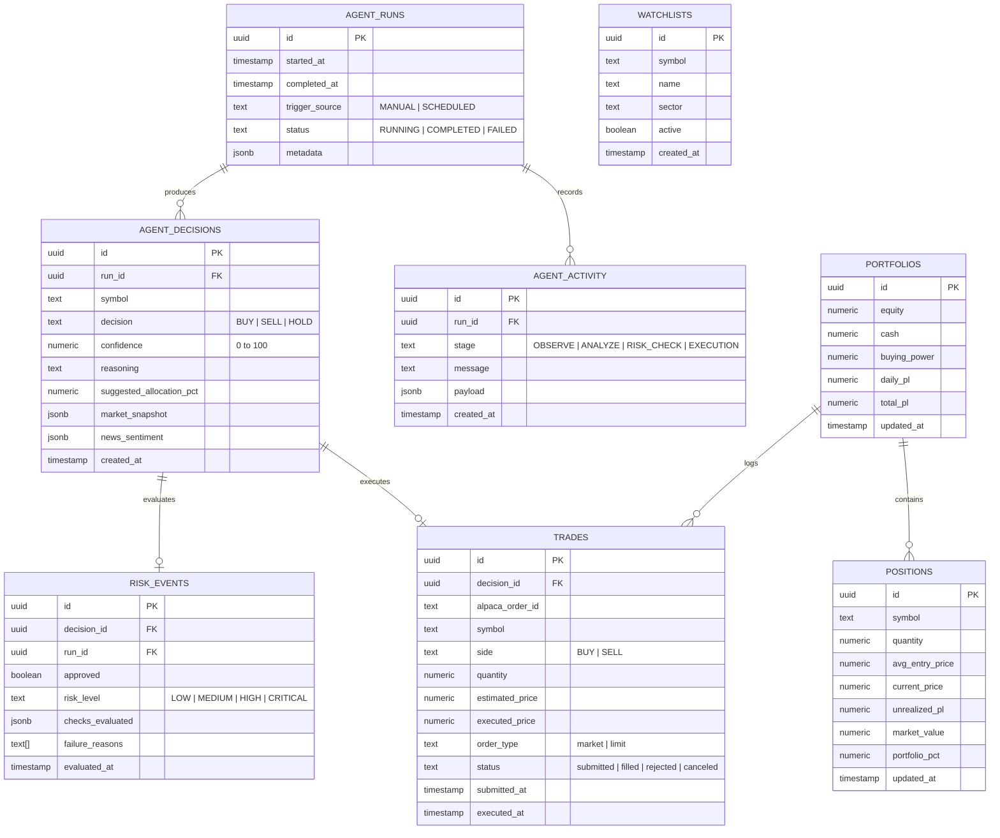

# SENTINEL — Database Architecture & Schema Specification

---

## 1. Relational Entity Diagram



---

## 2. Complete PostgreSQL Schema DDL

You can execute this script in the Supabase SQL editor:

```sql
-- Enable UUID extension
CREATE EXTENSION IF NOT EXISTS "uuid-ossp";

-- 1. Agent Runs: High-level session lifecycle
CREATE TABLE IF NOT EXISTS agent_runs (
    id UUID PRIMARY KEY DEFAULT uuid_generate_v4(),
    started_at TIMESTAMPTZ NOT NULL DEFAULT NOW(),
    completed_at TIMESTAMPTZ,
    trigger_source TEXT NOT NULL DEFAULT 'MANUAL',
    status TEXT NOT NULL DEFAULT 'RUNNING' CHECK (status IN ('RUNNING', 'COMPLETED', 'FAILED')),
    metadata JSONB DEFAULT '{}'::jsonb
);

-- 2. Agent Decisions: AI Proposals and Rationale
CREATE TABLE IF NOT EXISTS agent_decisions (
    id UUID PRIMARY KEY DEFAULT uuid_generate_v4(),
    run_id UUID REFERENCES agent_runs(id) ON DELETE CASCADE,
    symbol VARCHAR(12) NOT NULL,
    decision VARCHAR(10) NOT NULL CHECK (decision IN ('BUY', 'SELL', 'HOLD')),
    confidence NUMERIC(5, 2) NOT NULL CHECK (confidence >= 0 AND confidence <= 100),
    reasoning TEXT NOT NULL,
    suggested_allocation_pct NUMERIC(5, 2) DEFAULT 0.0,
    market_snapshot JSONB NOT NULL DEFAULT '{}'::jsonb,
    news_sentiment JSONB NOT NULL DEFAULT '{}'::jsonb,
    created_at TIMESTAMPTZ NOT NULL DEFAULT NOW()
);

-- 3. Risk Events: Deterministic Risk Audits
CREATE TABLE IF NOT EXISTS risk_events (
    id UUID PRIMARY KEY DEFAULT uuid_generate_v4(),
    decision_id UUID REFERENCES agent_decisions(id) ON DELETE SET NULL,
    run_id UUID REFERENCES agent_runs(id) ON DELETE CASCADE,
    approved BOOLEAN NOT NULL,
    risk_level VARCHAR(15) NOT NULL CHECK (risk_level IN ('LOW', 'MEDIUM', 'HIGH', 'CRITICAL')),
    checks_evaluated JSONB NOT NULL DEFAULT '[]'::jsonb,
    failure_reasons TEXT[] DEFAULT ARRAY[]::TEXT[],
    evaluated_at TIMESTAMPTZ NOT NULL DEFAULT NOW()
);

-- 4. Trades: Alpaca Paper Trade Executions
CREATE TABLE IF NOT EXISTS trades (
    id UUID PRIMARY KEY DEFAULT uuid_generate_v4(),
    decision_id UUID REFERENCES agent_decisions(id) ON DELETE SET NULL,
    alpaca_order_id VARCHAR(64) UNIQUE,
    symbol VARCHAR(12) NOT NULL,
    side VARCHAR(8) NOT NULL CHECK (side IN ('BUY', 'SELL')),
    quantity NUMERIC(12, 4) NOT NULL,
    estimated_price NUMERIC(12, 4) NOT NULL,
    executed_price NUMERIC(12, 4),
    order_type VARCHAR(20) NOT NULL DEFAULT 'market',
    status VARCHAR(20) NOT NULL DEFAULT 'submitted',
    submitted_at TIMESTAMPTZ NOT NULL DEFAULT NOW(),
    executed_at TIMESTAMPTZ
);

-- 5. Agent Activity: Granular Trace Timeline
CREATE TABLE IF NOT EXISTS agent_activity (
    id UUID PRIMARY KEY DEFAULT uuid_generate_v4(),
    run_id UUID REFERENCES agent_runs(id) ON DELETE CASCADE,
    stage VARCHAR(30) NOT NULL CHECK (stage IN ('OBSERVE', 'ANALYZE', 'RISK_CHECK', 'EXECUTION', 'ERROR')),
    message TEXT NOT NULL,
    payload JSONB DEFAULT '{}'::jsonb,
    created_at TIMESTAMPTZ NOT NULL DEFAULT NOW()
);

-- 6. Portfolios Snapshot
CREATE TABLE IF NOT EXISTS portfolios (
    id UUID PRIMARY KEY DEFAULT uuid_generate_v4(),
    equity NUMERIC(14, 2) NOT NULL,
    cash NUMERIC(14, 2) NOT NULL,
    buying_power NUMERIC(14, 2) NOT NULL,
    daily_pl NUMERIC(14, 2) NOT NULL DEFAULT 0.0,
    total_pl NUMERIC(14, 2) NOT NULL DEFAULT 0.0,
    updated_at TIMESTAMPTZ NOT NULL DEFAULT NOW()
);

-- 7. Positions Snapshot
CREATE TABLE IF NOT EXISTS positions (
    id UUID PRIMARY KEY DEFAULT uuid_generate_v4(),
    symbol VARCHAR(12) NOT NULL UNIQUE,
    quantity NUMERIC(12, 4) NOT NULL,
    avg_entry_price NUMERIC(12, 4) NOT NULL,
    current_price NUMERIC(12, 4) NOT NULL,
    unrealized_pl NUMERIC(12, 4) NOT NULL DEFAULT 0.0,
    market_value NUMERIC(14, 2) NOT NULL,
    portfolio_pct NUMERIC(5, 2) NOT NULL DEFAULT 0.0,
    updated_at TIMESTAMPTZ NOT NULL DEFAULT NOW()
);

-- 8. Watchlists
CREATE TABLE IF NOT EXISTS watchlists (
    id UUID PRIMARY KEY DEFAULT uuid_generate_v4(),
    symbol VARCHAR(12) NOT NULL UNIQUE,
    name VARCHAR(100) NOT NULL,
    sector VARCHAR(60),
    active BOOLEAN DEFAULT TRUE,
    created_at TIMESTAMPTZ NOT NULL DEFAULT NOW()
);

-- Optimization Indexes
CREATE INDEX IF NOT EXISTS idx_agent_decisions_symbol ON agent_decisions(symbol);
CREATE INDEX IF NOT EXISTS idx_agent_decisions_created_at ON agent_decisions(created_at DESC);
CREATE INDEX IF NOT EXISTS idx_trades_alpaca_order_id ON trades(alpaca_order_id);
CREATE INDEX IF NOT EXISTS idx_trades_submitted_at ON trades(submitted_at DESC);
CREATE INDEX IF NOT EXISTS idx_agent_activity_run_id ON agent_activity(run_id);
CREATE INDEX IF NOT EXISTS idx_risk_events_approved ON risk_events(approved);
```
